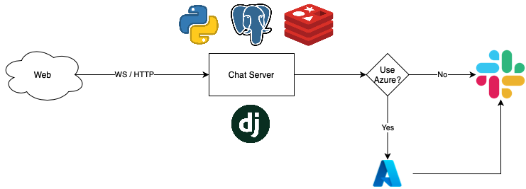

# Chat Slack Integration Server

This project is the backend for the following frontend module:
https://github.com/JangasIntegrationplace/chat-fontend

This sheet should explain the serverside setup process.
It's an own microservice which you could host on top of your existing
application.

This project can be used as a standalone backend system which is
directly connected to slack for proceeding into- & receiving messages
from Slack. This process is a synchronous process and depends on
availability of Slack. You could also add an additional Azure Setup
which runs completely asynchronous through different stages.
The Azure setup will be managed separately. Go to this repository:
https://github.com/JangasIntegrationplace/AzureCustomerPipeline

## Preparing
Doesn't matter which approach you use, you need to have an App in
Slack and grant some permissions. Follow these instructions:
1. Open https://api.slack.com
2. Click at create App and choose `From Scratch`
3. Give your App a name (doesnt matter which name) and choose your
    workspace
4. Choose `Features > OAuth & Permissions` from the left sidebar
5. Scroll to scopes and choose following options:
    - `channels:join`
    - `chat:write`
    - `chat:write.public`
    - `channels:history`
    - `app_mentions:read`
6. Scroll up to `OAuth Tokens for Your Workspace` and install your
    app to your workspace.
7. Copy the Bot User OAuth Token and store it somewhere for a later
    point
8. Start Serverside Setup ov your Django application. And come back
    to this setup later.
9. Choose `Features > Event Subscriptions` from the left sidebar
10. **Note this step will fail if you are not done with your**
    **serverside setup yet** depends on your Setup, add your request
    URL
    - Standalone: `{Your Base URL}/api/slack/`
    - Azure: **TODO**
11. Choose `Subscribe to bot events`
12. Add following events (**Note** this step breaks if step 10 was
    not successful):
    - app_mention
    - message.channels

## Techstack
- Python v3.8
- daphne
- Redis
- Postgres
- Django, Django Restframework, Channels
- Docker and Docker Compose

## Standalone Setup (Ubuntu)
You can use any other instance or setup. This Guide is made for
Digital Ocean Ubuntu Instance.

**Please note** You should have followed first 7 Steps for Slack
setup.

- Docker & Docker Compose
- Open your Firewall for Port 8001
- Clone this Repository and navigate into it
- Go to https://djecrety.ir and generate a secret key for django
- Run `bash deploy.sh -a {APPLICATION django // django-kafka-consumer} -s {DJANGO SECRET KEY} -t {SLACK BOT TOKEN} -k {KAFKA HOST}`

## Azure Setup
**TBD**
